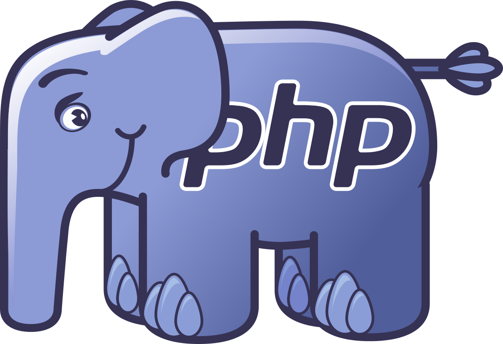

    

# Estudos PHP

Este diretório serve para se tornar uma biblioteca digital de todos os materiais, revisões,
artigos e projetos que estarei criando durante meus estudos de PHP.

A ideia aqui é abordar assuntos relacionados apenas a PHP e não a frameworks.

## Materiais

Os materias utilizados durante o aprendizado de processo deste repositório foram:

[Alura](https://www.alura.com.br/)
[PHP4Noobs](https://github.com/DanielHe4rt/php4noobs)
[Livro - PHP Programando Orientado a Objetos - Pablo Dall’Oglio](https://www.amazon.com.br/Php-Programando-com-Orienta%C3%A7%C3%A3o-Objetos/dp/8575226916)

## Conteúdo
- 1 - Básico do PHP
  - [1.1 - O inicío do PHP](docs/1-fundamentos/who-is-php.md)
  - [1.2 - Entendendo sobre o PHP](docs/1-fundamentos/about-php.md)
  - [1.3 - Entendendo o arquivo de configuração.](docs/1-fundamentos/)
  - [1.4 - Estrutura do código fonte.](docs/1-fundamentos/)
  - [1.5 - Comentando seu código.](docs/1-fundamentos/)
  - [1.6 - Tipos de Output.](docs/1-fundamentos/)
  - [1.7 - Tipos de váriaveis](docs/1-fundamentos/)
### Contribuidores
Nicolas Pereira - [Linkedin](https://www.linkedin.com/in/nicolas-pereira/) | [Twitter](twitter.com/devnic_)